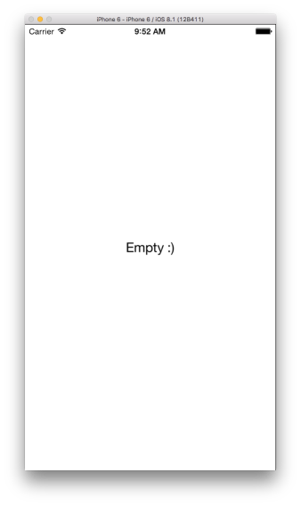

# HSImageSlider

파일럿 프로젝트 첫번째 과제입니다.

갤러리처럼 좌우로 스와이프해서 이미지를 볼 수 있는 뷰 입니다.
무한스크롤이 가능합니다.
화면 하단 중앙에 개수가 표시됩니다.
이미지가 없으면 `image_not_found.png` 파일로 보여줍니다.
이미지 개수가 0개 이면 레이블로 비었다고 표시해줍니다.

* `HSImageSlider` 폴더 통째로 가져가서 쓰시면 됩니다.
* `Example` 폴더는 HSImageSlider를 적용한 예제 프로젝트입니다. (이미지포함)


## 사용법
`HSImageSlider.h` 헤더파일 import하고 `HSImageSlider` 뷰를 생성해서 add합니다.
```objective-c
#import "HSImageSlider.h"

- (void)viewDidLoad {
    [super viewDidLoad];

    HSImageSlider *imageSlider = [[HSImageSlider alloc] initWithFrame:frame];
    imageSlider.dataSource = self;
    imageSlider.delegate = self;

	[self.view addSubview:imageSlider];
}
```

`HSImageSliderDataSource` 프로토콜 required 메서드 2개를 구현합니다.
```objective-c
- (NSInteger)countForImageSlider {
	return 이미지개수
}
- (UIImage *)imageAtIndex:(NSInteger)index {
	return 이미지
}
```

필요에 따라 `HSImageSliderDataSource`, `HSImageSliderDelegate` 프로토콜 optional 메서드를 구현합니다.
```objective-c
// HSImageSliderDataSource optional 메서드
- (HSImageSliderScrollState)scrollStateForImageSlider;
- (HSImageSliderIndicatorState)indicatorStateForImageSlider;
- (NSString *)emptyStringForImageSlider;

// HSImageSliderDelegate optional 메서드
- (void)didMoveToImageAtIndex:(NSInteger)index;
- (void)didSelectImageAtIndex:(NSInteger)index;
```

## 스크린샷





